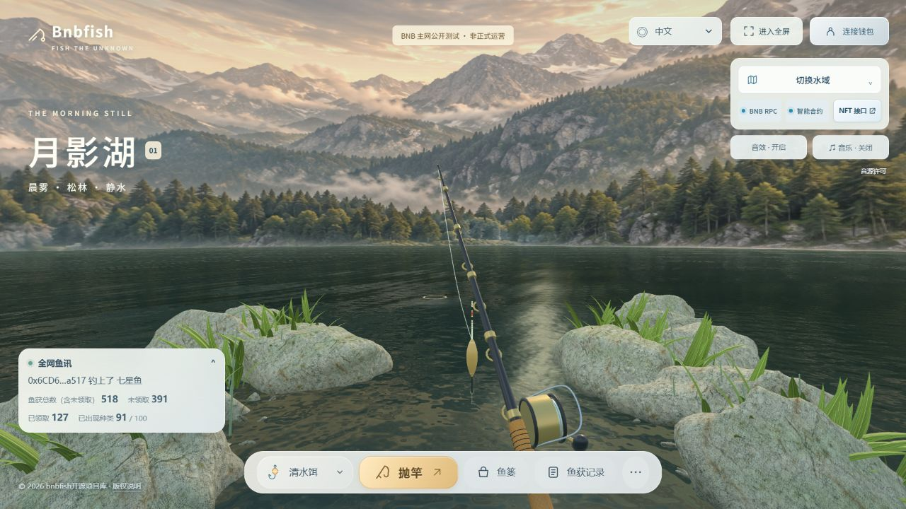
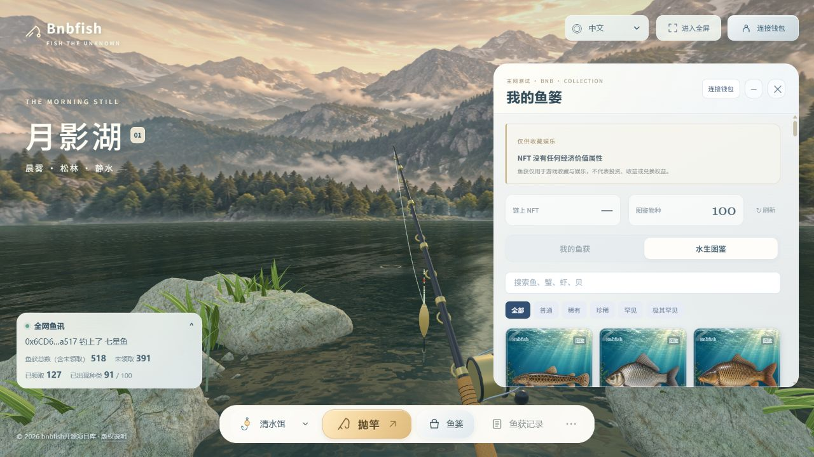

# BNBFISH

<p align="center"></p>

<p align="center"><strong>BNBFISH</strong> · BNB Smart Chain fishing game and ERC-721 collectible reference implementation</p>

> This project is for entertainment, collection and software development. NFTs have no promised economic value.

## 游戏画面 / Screenshots

以下图片于 **2026-09-20** 直接截取自 [bnbfish.trade](https://bnbfish.trade/) 正在运行的网页，保留完整浏览器视口。全网渔汛数字仅代表截图时的状态。

Captured directly from the running [live website](https://bnbfish.trade/) on **2026-09-20**, with the full browser viewport preserved. Catch statistics reflect the moment of capture.

### 湖面与垂钓操作 / Lake and fishing controls



### 鱼篓中的水生图鉴 / Aquatic encyclopedia in the basket panel



截图时未连接钱包；图鉴展示物种资料，不代表个人已持有的 NFT。图片来源及界面状态见 [截图说明 / Screenshot provenance](docs/screenshots/README.md)。

The wallet was disconnected. Encyclopedia cards describe species, not NFTs owned by a player. See [screenshot provenance](docs/screenshots/README.md).

## What is included / 项目内容

- `contracts/` — Solidity contracts, fixed supply allocation and ERC-721 metadata.
- `web/` — browser game UI, responsive layout, localization, card gallery and artwork.
- `service/` — read-only web API and on-chain global catch statistics.
- `tests/` — local contract, protocol, budget and UI regression tests.
- `docs/` — public protocol and integration notes.
- `config/example.json` — safe local configuration with zero addresses.

## Architecture

```text
Browser wallet ── transaction ──> BNB Chain contract ──> ERC-721 catch
       │                                  │
       └──── read-only API <──────────────┘
                    │
             global catch feed
```

The browser never receives a seed phrase or private key. Claims and transfers are signed by the user wallet. The read-only API is not the source of truth; contract state and ERC-721 events are authoritative.

## Local development

Requirements: Node.js 20+, npm or pnpm, and a local EVM node for contract tests.

```bash
npm install
cp .env.example .env
cp config/example.json config/production.json
npm run build
npm test
npm start
```

Open `http://localhost:4187/`. The example config uses a zero contract address and local-development mode. Do not use it to sign or send mainnet transactions.

## Mainnet deployment

Production deployment is intentionally excluded from this public repository. Keep server credentials, operator keys, TLS files, RPC tokens and deployment state in a separate private operations repository or secret manager. Inject secrets at runtime; never commit them. Verify contract source and bytecode independently on BscScan before interacting with a deployment.

## NFT images and metadata

The contract provides ERC-721 metadata. Card artwork is served as a web asset in this reference implementation. Integrators should read `tokenURI`, verify ownership with `ownerOf`, and treat image URLs as presentation assets. See [`web/developers/nft/index.html`](web/developers/nft/index.html).

## Copyright and secondary development / 版权与二次开发

中文和英文的版权、素材归属、Fork 与二次开发要求见 [`docs/COPYRIGHT-AND-SECONDARY-DEVELOPMENT.md`](docs/COPYRIGHT-AND-SECONDARY-DEVELOPMENT.md)。

## Security and privacy

See [`SECURITY.md`](SECURITY.md). Do not put SSH passwords, seed phrases, private keys, RPC credentials, server IPs or operator state in issues, pull requests or commits.

## License

MIT. Artwork and third-party dependencies retain their own licenses.
